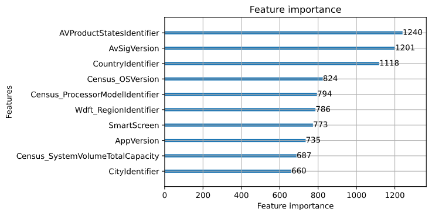

# Microsoft Malware Prediction

## COMP9417 Machine Learning Project

[TOC]

### Introduction

...

### Implementation

#### Reduce memory usage

First, we should focus on the dataset. The data given for this competition is huge. The training set is 4.08GB and the test set is 3.54GB. When use normal ``read_csv()`` function without any preprocess to load the CSV file, it will definitely take really long time and waste much memory space. To analyze the datatype of each column, we don't need to load the whole dataset. We can use the parameter ``chunksize`` to load a small bunch of data, or transfer our CSV file to [HDF5](https://support.hdfgroup.org/HDF5/whatishdf5.html) which can make it easier for us to use [Vaex](https://github.com/vaexio/vaex) library to do feature learning on our dataset.

There are several rules to reduce the pandas DataFrame size:

- Load ``object`` dtype as ``categories``
- Load binary value like (0,1) as ``int8``
- ``float64`` can be switched to ``float32`` or ``float16``

#### Feature learning

##### Drop columns which are mostly missing

```python
sorted([(i,train[i].countna()) for i in train],key=lambda a:a[1], reverse=True)
```

```txt
PuaMode                                           0.9997411865269485
Census_ProcessorClass                             0.9958940682843872
DefaultBrowsersIdentifier                         0.9514163732644001
Census_IsFlightingInternal                        0.8304402978742436
Census_InternalBatteryType                        0.7104680914596823
Census_ThresholdOptIn                             0.635244723326828
Census_IsWIMBootEnabled                           0.6343903810610859
SmartScreen                                       0.35610794752397107
OrganizationIdentifier                            0.3084148677972037
SMode                                             0.0602768620418825
CityIdentifier                                    0.0364747654621995
Wdft_IsGamer                                      0.034013515465982504
Wdft_RegionIdentifier                             0.034013515465982504
Census_InternalBatteryNumberOfCharges             0.030124475941948215
...
```

There are 2 columns **PuaMode** and **Census_ProcessorClass** which have more than 99% of missing values.

##### Drop columns which are mostly same values

Count the frequency of values in each column, there are 12 categorical columns whose majority category covers more than 99% of occurrences. This can be count by ``value_counts(dropna=True, normalize=True)``. Also, this information is shown on the [kaggle webpage](https://www.kaggle.com/c/microsoft-malware-prediction/data?select=train.csv).

Therefore, these columns below can be removed:

```python
['PuaMode',
 'Census_ProcessorClass',
 'Census_IsWIMBootEnabled',
 'IsBeta',
 'Census_IsFlightsDisabled',
 'Census_IsFlightingInternal',
 'AutoSampleOptIn',
 'Census_ThresholdOptIn',
 'SMode',
 'Census_IsPortableOperatingSystem',
 'PuaMode',
 'Census_DeviceFamily',
 'UacLuaenable',
 'Census_IsVirtualDevice']
```

##### Drop columns which are highly correlated

We can use ``pandas`` ``corr`` and ``pyplot`` to draw a [heatmap](./pics/heatmap.png) about the correlation. Before using ``corr``, it is necessary to transfer categorical features, in this case, I use ``LabelEncoder``[^1].

[^1]: https://scikit-learn.org/stable/modules/preprocessing_targets.html#preprocessing-targets


Pickup the dark pixels which have high value in this heatmap, those are highly correlated features. And drop the columns which have fewer unique values.

##### Final result about our dropped features

Based on our feature learning result and referred to others' work, we decided to remove these unuseful columns to save our training time and memory usage.

```python
['PuaMode',
 'Census_ProcessorClass',
 'Census_IsWIMBootEnabled',
 'IsBeta',
 'Census_IsFlightsDisabled',
 'Census_IsFlightingInternal',
 'AutoSampleOptIn',
 'Census_ThresholdOptIn',
 'SMode',
 'Census_IsPortableOperatingSystem',
 'Census_DeviceFamily',
 'UacLuaenable',
 'Census_IsVirtualDevice',
 'Platform',
 'Census_OSSkuName',
 'Census_OSInstallLanguageIdentifier',
 'Processor']
```

#### Baseline

...

#### LightGBM

I used [LightGBM](https://github.com/microsoft/LightGBM) as my training framework for this competition.
> It is a fast, distributed, high performance gradient boosting (GBT, GBDT, GBRT, GBM or MART) framework based on decision tree algorithms. [^2]
[^2]: Ke, Guolin, et al. "Lightgbm: A highly efficient gradient boosting decision tree." Advances in neural information processing systems. 2017.

I applied our feature engineering conclusion, dropped some unnecessary and high correlation features. For the NaN and missing value part, I just use the LightGBM default method which can make our preprocessing part simpler. For the categorical features, LightGBM could handle them directly, which means encode part can be left out. But it is not support in GPU acceleration, I still use ``LabelEncoder`` in my implementation.

Due to my limitation of compute resource. I picked a large learning rate 0.5 in this case. For parameters tuning part, there are some rules from LightGBM, in conclusion: tuning small ``learning_rate`` with large ``num_iterations``, setting small ``num_leaves``, using bagging by set ``bagging_fraction`` and ``bagging_freq``. To reduce coding work, I imported ``optuna``[^3] library to automatically running the parameters tuning.
[^3]: Takuya Akiba, Shotaro Sano, Toshihiko Yanase, Takeru Ohta,and Masanori Koyama. 2019. "Optuna: A Next-generation Hyperparameter Optimization Framework." In KDD.




The result looks fine compared with our baseline. We still need a lot of space to improve our model, like a deep feature engineering, some feature values could be cleaned and grouped. Besides, small learning rate can be applied.

### Experimentation

...
